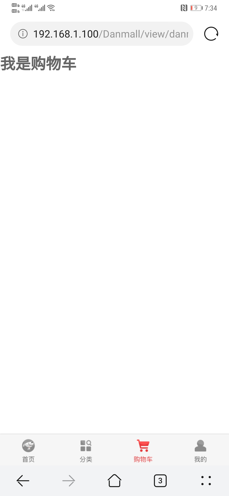
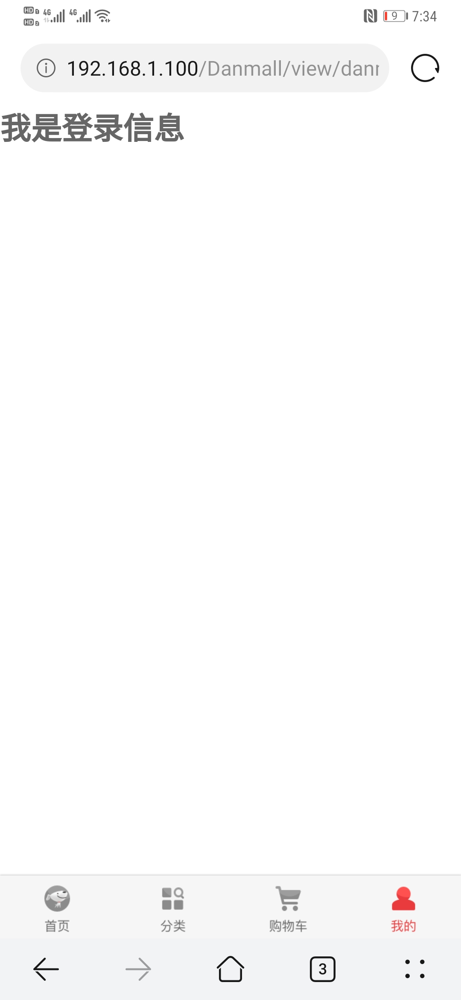

# danmall

## Anounce
vuejs for a danmall which like as jd.mall

by vue cli3 + thinkphp6

## 链接
[github](https://github.com/dangc9/danmall)
[gitee](https://gitee.com/dangc/danmall)

## 当前效果

<!-- 



 -->


## Project setup
```
npm install
```

### Compiles and hot-reloads for development
```
npm run serve
```

### Compiles and minifies for production
```
npm run build
```

### Lints and fixes files
```
npm run lint
```

### Customize configuration
See [Configuration Reference](https://cli.vuejs.org/config/).
